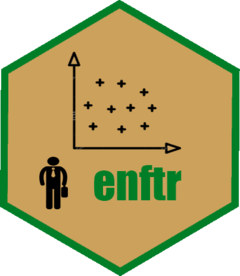

<!-- README.md is generated from README.Rmd. Please edit that file -->

```{r, include = FALSE}
knitr::opts_chunk$set(
  collapse = TRUE,
  comment = "#>",
  fig.path = "man/figures/README-",
  out.width = "100%"
)
source("contributors.R")
```

# enftr 

<!-- badges: start -->
[](https://www.repostatus.org/#wip)
[](https://www.tidyverse.org/lifecycle/#experimental)
[](https://github.com/endomer/enftr/actions)
[](https://codecov.io/gh/endomer/enftr?branch=main)
[](https://CRAN.R-project.org/package=enftr)
<!-- badges: end -->

enftr es una interfaz para trabajar con la base de datos de la Encuesta Nacional (tradicional) de Fuerza de Trabajo (ENFT) en R. Este paquete es parte de [endomer](https://endomer.github.io/) un proyecto de código abierto que busca ofrecer interfaces en R para las principales encuestas de la República Dominicana.

## Instalación

enftr aun no está en CRAN.

<!-- You can install the released version of encftr from [CRAN](https://CRAN.R-project.org) with: -->

<!-- ``` r -->
<!-- install.packages("encftr") -->
<!-- ``` -->

Pero puedes intalar la versión de desarrollo desde [GitHub](https://github.com/) con:

``` r
tryCatch(
  library(remotes),
  error = function(e){
    install.packages('remotes')
  }
)
remotes::install_github("endomer/enftr")
```

## Roadmap

```{r echo=FALSE, message=FALSE, results = 'asis'}
source("data-raw/dict.R")
progress <- length(dict) / (357+length(dict1))
progress <- ceiling(progress*100)
```

1. Completar el diccionario. 
2. Agregar una función para calcular la pobreza monetaria.
2. Agregar una función para el cálculo del ICV.
2. Escribir la guía de inicio rápido.
2. Agregar validadores a las funciones para garantizar que las variables son del tipo y con el contenido esperado en los cálculos.
2. Escribir tests.
2. Hacer que todas las funciones trabajen con conexiones a base de datos (Las que usan cut3 específicamente).


## Contribuye

Tienes comentarios o quieres contribuir?

Por favor, revisa las [guias de contribución (en inglés)](https://endomer.github.io/enftr/CONTRIBUTING.html) antes de iniciar un issue o pull request.

Por favor, observa que el proyecto `enftr` está sujeto a un [Código del contribuyente](https://contributor-covenant.org/es/version/2/0/CODE_OF_CONDUCT.html). Contribuyendo con el proyecto aceptas las términos y condiciones.


<hr/>

```{r echo=FALSE}
Dmisc::big_button("Guía de inicio rápido", "./articles/enftr.html")
```


